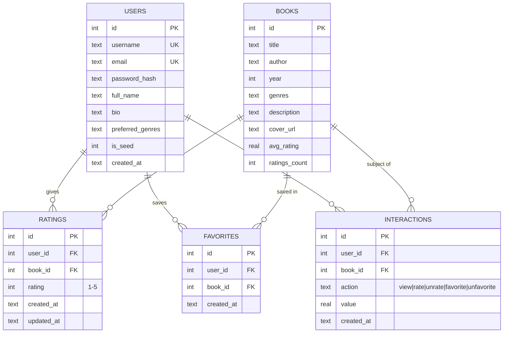
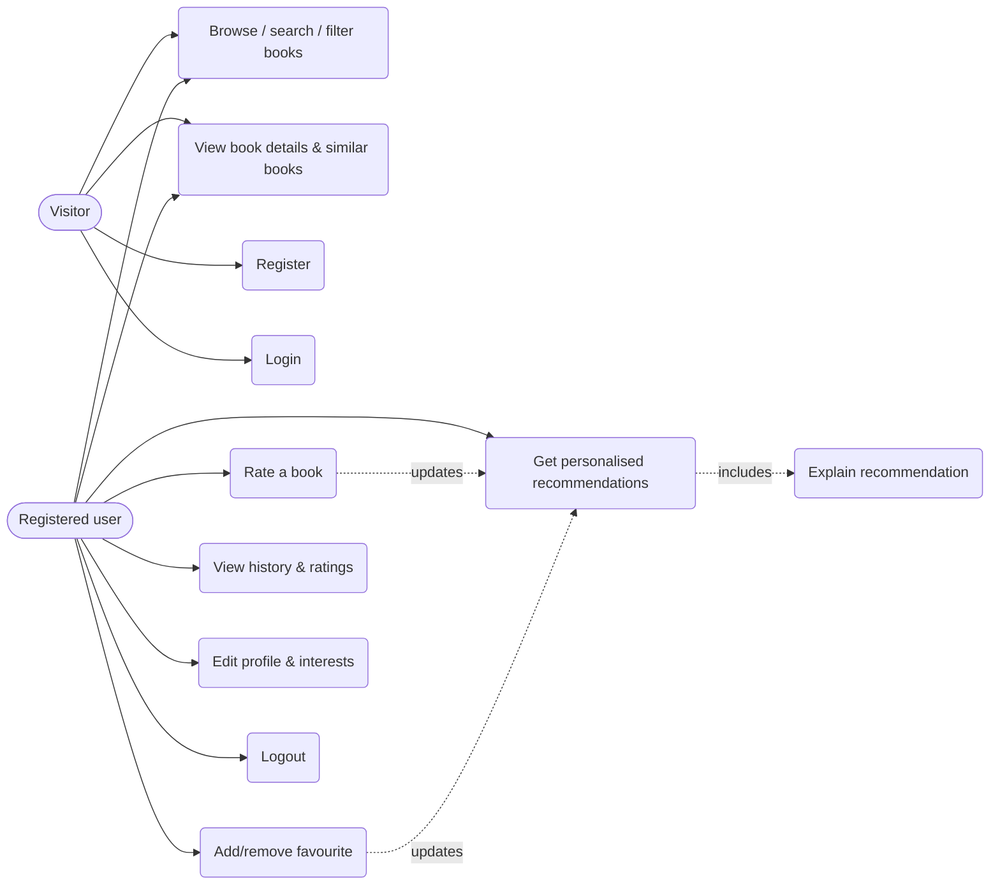

# Phases 1–3: Requirement Analysis, Technology Selection, System Design

## Phase 1 — Requirement Analysis
**Problem statement.** Readers face thousands of books and rely on generic bestseller lists. Such lists ignore personal
taste, give no explanation, and never learn. We need a system that learns each user's preferences from ratings,
favourites and chosen interests, and recommends relevant books *with reasons*.

**Objectives**
1. Build a web application for browsing, searching and filtering books.
2. Let users register, rate books, favourite books and see their history.
3. Build a hybrid recommender (content + collaborative + popularity) that personalises results.
4. Explain every recommendation in plain language.
5. Evaluate the recommender with standard metrics against baselines.

**Scope.** In: web app, recommender, evaluation, documentation. Out (future work): real-time deep-learning models,
payments, social features, admin CMS, mobile app.

**Functional requirements**
| ID | Requirement |
|---|---|
| FR1 | Register, login, logout, view/edit profile (incl. favourite genres) |
| FR2 | List books with title, author, genre, description, rating, year, cover |
| FR3 | Search by keyword; filter by genre, author, minimum rating; sort; paginate |
| FR4 | Rate a book 1–5 (change/remove rating); mark/unmark favourite |
| FR5 | Store interaction history (views, ratings, favourites) |
| FR6 | Personalised recommendations with match % and explanation |
| FR7 | "Similar books" on each book page |
| FR8 | Cold-start handling for new users (chosen genres + popularity) |
| FR9 | Recommendations improve as the user interacts |

**Non-functional requirements:** simple to install (free tools only), responsive UI, passwords hashed, CSRF/XSS/SQL-injection
protection, recommendations in < 1 s for the demo data, explainable, reproducible (fixed random seeds), documented and tested.

## Phase 2 — Technology Selection
| Component | Choice | Why (beginner-friendly reasoning) |
|---|---|---|
| Language | Python 3 | One language for web + ML; easy to read in a viva |
| Backend | **Flask** | Small, minimal boilerplate, easy to explain (vs Django's many hidden conventions) |
| Database | **SQLite** | Built into Python, no server to install, a single file to submit; SQL is standard |
| Frontend | HTML + CSS + vanilla JS (Jinja templates) | No Node/npm, no build step, works offline, fewer moving parts than React |
| ML | **pandas, NumPy, SciPy, scikit-learn** | Industry-standard, TF-IDF and cosine similarity are 1-line calls and easy to explain |
| Testing | `unittest` | Part of Python — nothing to install |
Not used (deliberately): deep learning, Docker, Redis, microservices, React — they add complexity without improving a college demo.

## Phase 3 — System Design

### 3.1 Architecture
```
 ┌───────────────┐   HTTP    ┌────────────────────────── Flask application ───────────────────────────┐
 │ Browser       │◄─────────►│  Routes (main.py, auth.py)   REST API (api.py)                          │
 │ HTML/CSS/JS   │  JSON     │            │                        │                                   │
 └───────────────┘           │            ▼                        ▼                                   │
                             │        services.py  (business logic, validation, recommender cache)     │
                             │            │                        │                                   │
                             └────────────┼────────────────────────┼───────────────────────────────────┘
                                          ▼                        ▼
                                  ┌──────────────┐        ┌─────────────────────────┐
                                  │ SQLite DB    │◄──────►│ ml/engine.py            │
                                  │ users, books │ train  │ HybridRecommender       │
                                  │ ratings, ... │ data   │ TF-IDF + CF + popularity│
                                  └──────────────┘        └─────────────────────────┘
        Offline pipeline:  raw CSV → ml/preprocess.py → clean CSV → scripts/init_db.py → DB ;  ml/evaluate.py → metrics
```

### 3.2 Data flow (recommendation request)
1. User opens **For You** → `GET /recommendations`.
2. `services.model_inputs` reads the user's ratings, favourites, recent views and chosen genres from SQLite.
3. `services.get_engine` returns the trained model (re-trains lazily if new ratings arrived > 30 s ago).
4. `HybridRecommender.recommend` scores every unread book, returns top-K + reasons.
5. Book details are loaded from the DB, decorated with favourite/rating flags and rendered.
6. When the user rates or favourites a book (`POST /api/...`), the DB is updated, history is logged, and the model is marked stale.

### 3.3 Database design (ER diagram)

Constraints: `UNIQUE(user_id, book_id)` on ratings and favourites; `CHECK(rating BETWEEN 1 AND 5)`; foreign keys with `ON DELETE CASCADE`;
indexes on `ratings(book_id)`, `ratings(user_id)`, `favorites(user_id)`, `interactions(user_id, created_at)`.
The full SQL is in `app/schema.sql`. *Design note:* genres are stored as a `;`-separated string for simplicity; a production design would add `genres` and `book_genres` tables.

### 3.4 Use-case diagram


### 3.5 Main modules
| Module | Files | Responsibility |
|---|---|---|
| Authentication | `auth.py`, `security.py` | Registration, login, sessions, CSRF, throttling |
| Book management | `main.py`, `services.search_books` | Listing, search, filters, detail pages |
| Interaction | `api.py`, `services.py` | Ratings, favourites, history logging |
| Recommendation engine | `ml/engine.py` | Content + CF + popularity, explanations |
| Data pipeline | `ml/preprocess.py`, `scripts/init_db.py` | Cleaning and loading data |
| Evaluation | `ml/evaluate.py` | Metrics and baselines |
| UI | `templates/`, `static/` | Responsive pages |
